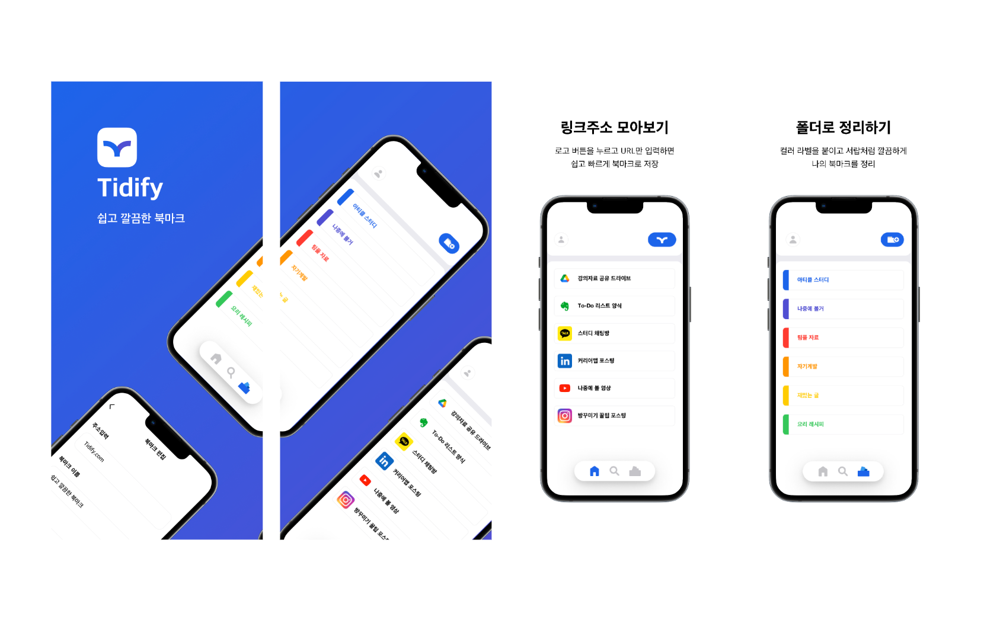

### 🔗 [iOS Repo](https://github.com/Nexters/tidify-iOS)

# Project Tech Stack
- Java 17
- Springboot 2.7.8
- Jpa 
- QueryDSL 1.0.10
- Docker
- Mysql 8
- NCloud
- Prometheus / Grafana
- <s>Redis</s>

# 프로젝트 아키텍트

- 작성중

# DB ERD 구조

- 작성중

# 인수 테스트 시나리오

> ### Folder 도메인 시나리오

| Given            | When        | Then                          |
|------------------|-------------|-------------------------------|
| 폴더가 저장되어 있을 때    | 폴더 조회 시     | 이름과 라벨의 값은 반드시 존재한다.          |
| 폴더의 이름과 라벨을 지정하여 | 폴더를 저장하면    | 폴더는 정상적으로 저장된다.               |
| 저장된 폴더의          | 이름을 수정하면    | 폴더의 이름이 수정된다.                 |
| 폴더 생성 시          | 이름이 누락되면    | 예외를 던진다.                      |
| 폴더 생성 시          | 라벨이 누락되면    | 예외를 던진다.                      |
| 폴더에 북마크가 존재할 때   | 해당 폴더를 삭제하면 | 북마크는 폴더가 지정되지 않은 상태로 업데이트 된다. |

> ### Bookmark 도메인 시나리오

| Given          | When                   | Then                   |
|----------------|------------------------|------------------------|
| 북마크 저장되어 있을 때  | 북마크 조회 시               | 이름과 URL 값은 반드시 존재한다.   |
| 북마크가 저장되어 있을 때 | 특정 검색어와 일치하는 북마크가 존재하면 | 해당 북마크가 조회된다.          |
| 북마크를 저장할 때     | 이름과 URL 이 모두 지정되면      | 해당 값으로 북마크가 저장된다.      |
| 북마크를 저장할 때     | URL 은 지정 했지만 이름이 누락되면  | 이름은 URL과 동일한 값으로 저장된다. |
| 북마크를 저장할 때 ☑️  | URL 이 누락되면             | 예외를 던진다.               |
| 북마크를 수정할 때     | 이름을 수정하면               | 북마크의 이름이 수정된다.         |
| 북마크를 수정할 때     | 이름을 빈값으로 수정하면          | 이름은 URL과 같은 값으로 수정된다.  |
| 북마크를 수정할 때     | 폴더를 수정하면               | 북마크는 수정된 폴더에서 조회된다.    |
|                | 북마크를 삭제하면              | 해당 북마크는 조회되지 않는다.      |

